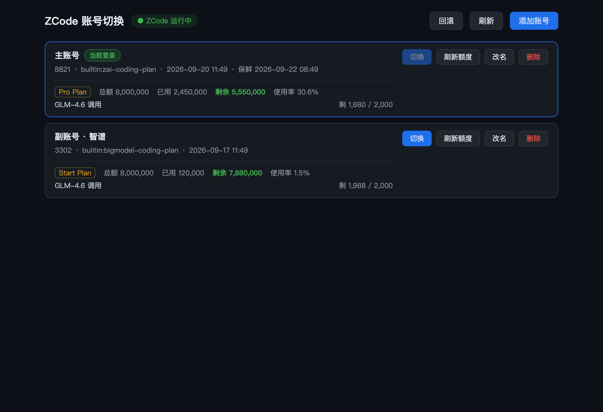

# zcas — ZCode 账号无感切换工具

登录一次，自由切换。把 ZCode 的多个账号登录态保存为快照，一键切换，
免去多账号之间反复走 OAuth + 验证码的繁琐流程。

**GUI（桌面应用）+ CLI 双形态，共享同一套核心库**。单二进制、零依赖，
账号数据全部存在本机（`~/.zcas/`），不上传任何服务器。

> 实现参考：[smartlizi/zcode-account-switcher](https://github.com/smartlizi/zcode-account-switcher)

## 功能特性

- **一键切换**：自动关闭 ZCode → 备份当前登录态 → 写入目标账号 → 重启 ZCode，秒级完成
- **添加账号两种方式**：
  - **OAuth 添加**：工具内发起浏览器登录（z.ai / BigModel 双渠道），登录完成自动入库，全程不触碰当前登录态
  - **抓取当前登录**：在 ZCode 客户端里登录后，一键把当前账号存为快照
- **额度总览**：账号列表自动展示每个账号的套餐与剩余额度，支持手动刷新
- **快照保鲜**：切换离开时自动把当前账号的最新 token 回写到它的快照，防 refresh token 过期搁浅
- **回滚兜底**：每次切换前自动整文件备份，误操作一键回到切换前的登录态
- **字段级快照**：只保存账号相关字段，切换时合并写回，不影响你的编辑器偏好与自定义 provider 配置

## 界面



账号一行一个：名称、ID、渠道、保存时间、套餐与剩余额度一目了然；
操作按钮（切换 / 刷新额度 / 改名 / 删除）固定在每行右上角；
当前登录的账号带「当前登录」徽标与高亮边框。
（截图中为演示数据）

## 安装

### 下载安装包（推荐）

| 平台 | 文件 | 安装方式 |
|---|---|---|
| macOS（Apple Silicon） | `zcas-x.y.z-macos-arm64.pkg` | 双击安装，自动装 App + CLI |
| macOS（Apple Silicon） | `zcas-x.y.z-macos-arm64.dmg` | 拖拽安装（仅 GUI） |
| Windows x64 | `zcas-x.y.z-windows-amd64-installer.exe` | 双击安装器 |
| Linux ARM64 | `zcas-x.y.z-linux-arm64.tar.gz` | 解压后 `sudo ./install.sh` |

> ⚠️ **平台验证状态**：macOS 版已实机完整验证；**Windows 与 Linux 版仅通过编译打包，尚未实机测试**，如遇问题欢迎提 Issue。
>
> 首次打开提示"无法验证开发者"（macOS）或 SmartScreen 拦截（Windows）时，
> 选择右键打开 / 仍要运行即可（个人分发未做 Apple 公证与微软签名）。
> Linux 运行 GUI 需要 `sudo apt install libwebkit2gtk-4.1-0`。

### 从源码构建

```bash
git clone <本仓库地址> && cd zcas
make release          # 一键出全平台安装包到 dist/（Windows 需 brew install makensis；Linux 需 Docker）

# 只构建本机可用的形态：
go build -o zcas ./cmd/zcas        # CLI
cd app && wails build              # GUI（需安装 wails CLI v2.16+）
```

替换应用图标：`scripts/make-icon.sh /path/to/新图标.png` 后重新 `make release`。

## 使用

### GUI

打开「ZCode 账号切换」：

1. **添加账号** → 选「OAuth 登录新账号」，浏览器登录 z.ai 或 BigModel，完成自动入库
   （macOS 上浏览器会自动跳回工具；Windows/Linux 需把地址栏的 `zcode://…` 链接粘贴回工具）
2. 或先在 ZCode 客户端登录，再用「抓取当前登录」入库
3. 点账号右侧「切换」，ZCode 自动重启并进入目标账号

### CLI

```bash
zcas                       # 当前登录账号 + 已保存账号列表
zcas capture --name 主账号     # 把当前 ZCode 登录态存为快照
zcas add                   # 浏览器 OAuth 添加新账号（不影响当前登录）
zcas use 2                 # 切换账号（自动关闭并重启 ZCode）
zcas quota                 # 查当前账号额度；zcas quota 2 查指定账号
zcas rollback              # 回滚到切换前的登录态
zcas rm / rename / kill / launch
```

## 工作原理（简述）

ZCode 的登录态由 `~/.zcode/v2/` 下两份文件构成：`credentials.json`（OAuth token、
用户档案等，`enc:v1` 前缀字段为机器绑定的 AES-256-GCM 加密）和 `config.json`
（明文 JWT apiKey 落在 provider 槽位）。zcas 把这两份文件中的**账号相关字段**
抽取为快照；切换时先备份现场、再把目标账号的字段合并写回，随后重启客户端。

加密字段使用 ZCode 本机派生密钥解密/加密，所有操作均在本机完成。

## 安全机制

- 切换前强制关闭 ZCode（SIGTERM → 超时 SIGKILL），防止客户端回写覆盖
- 每次切换前整文件备份到 `~/.zcas/.last/`，写入失败自动回滚
- 回写保鲜前做防污染校验（账号一致性 + token 可解密），旧快照留 `.bak`
- 全部写入原子化（先 `.tmp` 后 rename）

## 数据位置

| 路径 | 内容 |
|---|---|
| `~/.zcode/v2/` | ZCode 客户端登录态（本工具读写） |
| `~/.zcas/accounts/` | 账号快照（`<id>.meta.json` + `<id>.snap.json`） |
| `~/.zcas/.last/` | 切换前备份（回滚用） |
| `~/.zcas/config.json` | 可热更新配置（billing 请求参数） |

## 卸载

- **macOS**：删除 `/Applications/ZCode账号切换.app` 和 `/usr/local/bin/zcas`
- **Windows**：开始菜单卸载程序；CLI 删除解压目录
- **Linux**：删除 `/usr/local/bin/zcas`、`/usr/local/bin/zcas-gui` 及对应桌面文件
- 账号数据：`rm -rf ~/.zcas`（删除前请确认 ZCode 里已登录你要保留的账号）

## 致谢

- 实现参考：[smartlizi/zcode-account-switcher](https://github.com/smartlizi/zcode-account-switcher)
- 桌面框架：[Wails](https://wails.io)

## 免责声明

本工具仅供学习研究和个人使用，与 Z.AI / 智谱官方无任何关联。
请遵守相关服务条款，账号安全由使用者自行负责。
